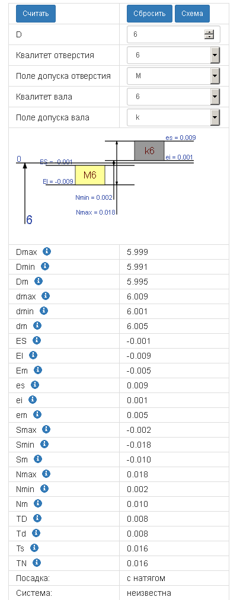
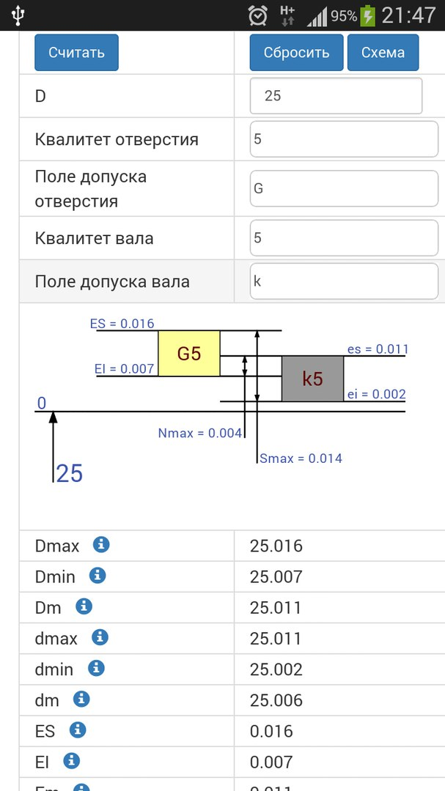

## Калькулятор ОВЗ

Приложение позволяет расчитывать допуски и посадки валов и отверстий

[**>> Онлайн-версия <<**](https://become-iron.github.io/ovz_calc)

[**>> Мобильная версия <<**](https://become-iron.github.io/ovz_calc/min_calc.html)

[**>> Приложение <<**](https://github.com/become-iron/ovz_calc/raw/master/app_build/builds/OVZCalc.apk)

### Зависимости
* Jquery 2.1.4
* D3 3.5.6
* Bootstrap 3.3.5 (для мобильной версии)

### Справочная информация
1. Верность подсчёта гарантируется верностью введённых данных
2. При изменении значений в полях не происходит перерасчёт
3. В качестве разделителя для дробных чисел следует использовать точку

### Скриншот

### Мобильная версия

### Приложение

### TODO
* ~~введение квалитетов~~
* ~~"мини-версия"~~
* просмотр ГОСТ-таблиц
* ~~мобильное приложение~~

### Создатели
* [become-iron](http://github.com/become-iron)
* [Alex1166](http://github.com/Alex1166)
