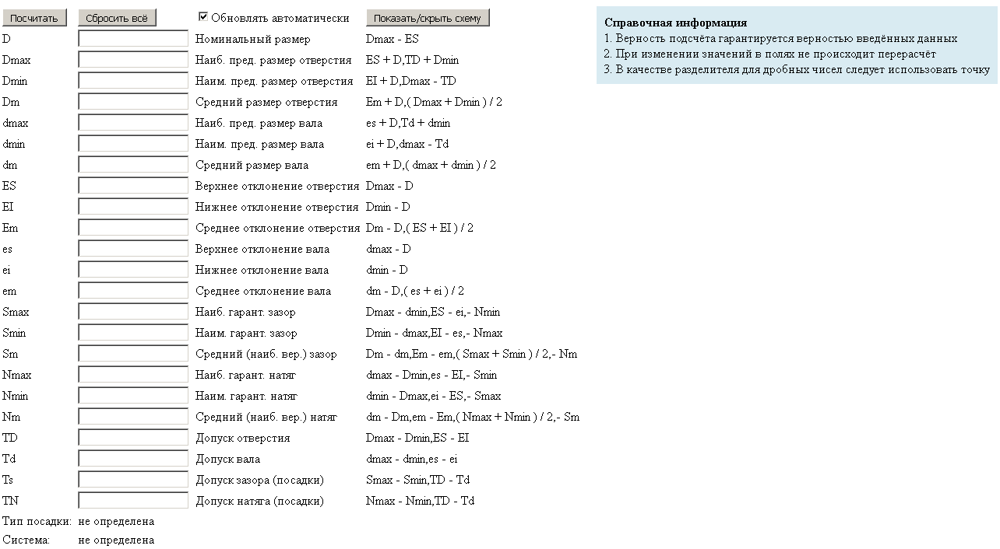

## Калькулятор ОВЗ

Приложение позволяет расчитывать допуски и посадки валов и отверстий

[**>> Просмотреть онлайн-версию <<**](http://become-iron.github.io/ovz_calc)

### Справочная информация
1. Верность подсчёта гарантируется верностью введённых данных
2. При изменении значений в полях не происходит перерасчёт
3. В качестве разделителя для дробных чисел следует использовать точку

### Скриншот

### TODO
* исправить ошибки
* несколько видов схем
* введение квалитетов
* мобильная версия
* мобильное приложение

### Создатели
* [become-iron](http://github.com/become-iron)
* [Alex1166](http://github.com/Alex1166)
